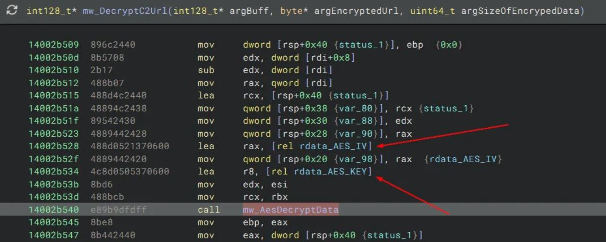
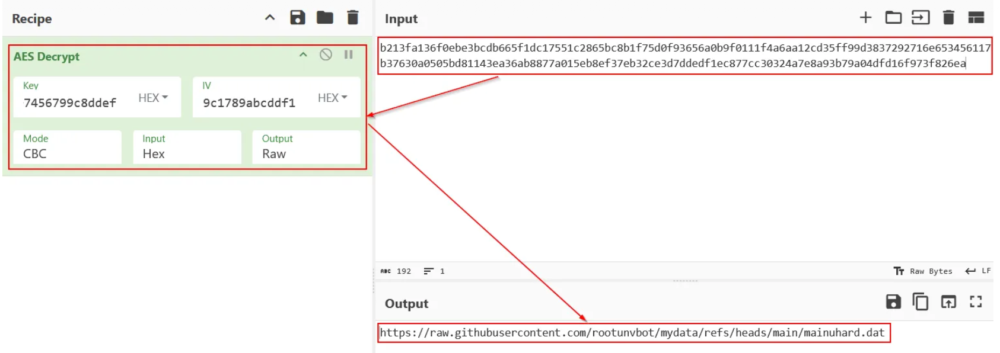
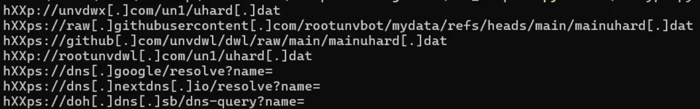
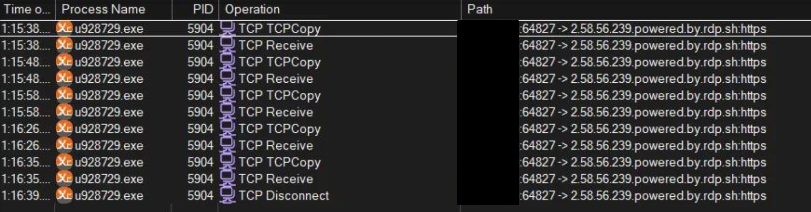
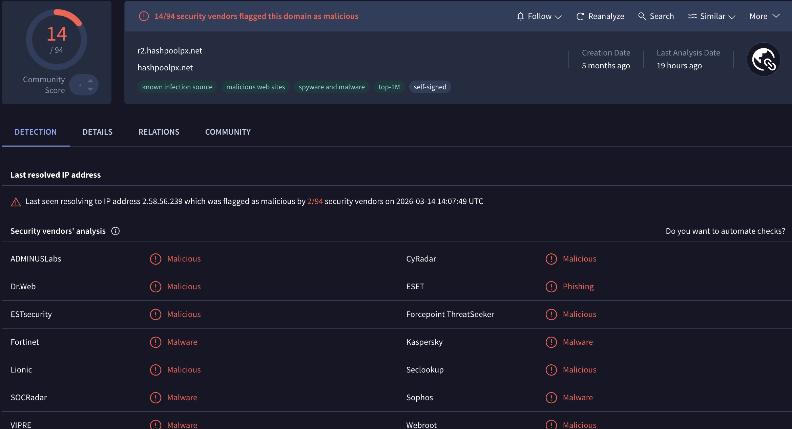



## Introduction

In today's blog post, we will perform some infrastructure threat hunting and try to cluster malicious crypto-mining campaigns. The core idea here is to show you how you can expand your visibility, starting with just one indicator of compromise (IOC). In this blog, we will hunt for the Tangerine Turkey campaign, which is still ongoing (at the time of writing). So, let's shed some light on the shadows.

### What is a mining pool?

If you're not familiar with the term "*mining*" in the context of the digital world, you probably shouldn't have a clue about what a "*mining pool*" is. The crypto world is a very complex and far beyond my current knowledge about this topic. So, let's define some key concepts right from the beginning without getting into too much detail.

Similarly, in the physical world, we mine gold, iron, and other minerals. In the digital realm, our computers can be used to mine digital assets (and no, we aren't referring to Minecraft...). Let's clarify what this term means.



> *A cryptocurrency is a decentralized digital currency secured by cryptography algorithms and typically recorded on a blockchain, **enabling peer-to-peer financial transactions without a central authority**.*
>

And if there is money involved, it's obvious that cybercriminals will try to find a way to take a bet on it. This is where the *crypto miners* come into play.

> *A crypto miner is a **computer or specialized hardware running software that performs cryptographic computations** to solve mathematical puzzles required to add a new blocks to the blockchain.*
>

As you can see, *a crypto miner by itself is not malicious*. As a good citizen, you can run your own miner or a *pool of miners* (at least if you already have the budget to invest in such hardware or infrastructure).

> *A mining pool is a **cooperative system in which multiple crypto miners combine their computing power** to increase the probability of discovering blocks and distribute rewards among participants based on their contributions.*
>

Currently, you might have questions like:

- How does a crypto miner turn malicious?
- And, how do cybercriminals abuse that technology?

Let's take a general look at the threat landscape and how cybercriminals are abusing crypto miners in the wild.

### The crypto miners threat landscape

A crypto miner turns malicious when installed on a computer without the owner's approval. To distinguish between legitimate miners and malicious ones, the term "*cryptojacking*" was coined. In the MITRE ATT&CK framework, the best description of this malicious activity appears in the [impact [TA0040]](https://attack.mitre.org/tactics/TA0040/) column under the sub-technique ["Resource Hijacking: Compute Hijacking" [T1496.001]](https://attack.mitre.org/techniques/T1496/001/). Below is a brief description of this technique.

> *One common purpose for [Compute Hijacking](https://attack.mitre.org/techniques/T1496/001) is to validate transactions of cryptocurrency networks and earn virtual currency. Adversaries may consume sufficient system resources to negatively impact affected machines and/or cause them to become unresponsive.* — MITRE ATT&CK
>

Those “malicious” software targets servers and cloud-based systems because of their high potential for available resources. However, personal computers and IoT devices can also be targets. You are probably wondering why I use double quotation marks around the word 'malicious', right? Well, let's take XMRig, for example. This is open-source mining software. It's a legitimate program, but it can become malicious when used with malicious intent to hijack a system's resources. This type of software would be better classified as a potentially unwanted program (PUP). This software is commonly abused by cybercriminals to mine for Monero cryptocurrency. But why Monero and not Bitcoin?

### Why Monero?

To better understand why cybercriminals prefer Monero over Bitcoin, let's see the difference between these two cryptocurrencies.

Bitcoin key characteristics:

- **Transparent blockchain:** Every transaction is publicly recorded.
- **Pseudonymous identities:** Wallets are not directly tied to real names, but all transaction flows are visible.
- **Traceable transactions:** Anyone can follow the movement of funds from one address to another.
- **Large ecosystem:** Exchanges, wallets, and payment processors widely support it.

Because the blockchain is fully public, Bitcoin transactions can be analyzed using blockchain analytics tools.

Different from Bitcoin, Monero is a **privacy-focused cryptocurrency**. Its core design goal is to make transactions **untraceable and unlinkable by default**.

Monero key characteristics:

- Privacy-first protocol
- Hidden transaction amounts
- Hidden sender and receiver
- Strong anonymity protections

This means that, **third parties cannot easily determine who sent money, who received it, or how much was transferred**. This explains why cybercriminal groups favor Monero over Bitcoin, as its privacy features directly undermine blockchain-based investigative methods. Another reason is that Monero mining is effective on CPUs, since it does not require specialized ASIC hardware.

But sometimes, cybercriminals don't care much about their anonymity and will try to mine various cryptocurrencies. A good example is the [PureCrypter (a.k.a PureMiner)](https://malpedia.caad.fkie.fraunhofer.de/details/win.purecrypter).

PureCrypter malware was developed using the .NET framework to mine multiple cryptocurrencies, including BTC, Ergo (ERG), ETHW, ETC, Flux (FLUX), Kaspa (KAS), Monero (XMR), and Ravencoin (RVN). It includes a “botkiller” feature that enables the operator to remove other malware from the infected device. The miner can seamlessly switch between CPU and GPU mining and monitor user activity to detect idleness. The attacker charged US$150 for a one-year subscription and US$199 for a lifetime license.

Some other campaign that will focus on this blog is Tangerine Turkey. Let's dive in and take an overview of this case.

## Hunting for mining pools

### The Tangerine Turkey operation

Tangerine Turkey is a cryptomining operation that uses a VBScript (VBS) worm to spread laterally by infecting removable drives like USB sticks. Its main goal is to maintain persistence by creating a scheduled task that runs with the highest privileges at user login. The TLS fingerprint used by XMRig on the command line helps us better understand the infrastructure behind this campaign. For more details about this operation, you can refer to the blogs by Cybereason and Red Canary in the resources section of this blog.

The Cybereason team created a great overview of the attack chain that we can use to better understand the campaign.



The main payload, `console_zero.exe`, is deployed and run from the System32 directory. To enhance persistence, the malware sets up a scheduled task called `console_zero`, which is configured to execute the payload at each user logon with the highest privileges.

The Command & Control configuration was encrypted with AES. Once decrypted, I chose to carry out a simple dynamic analysis.


  
  
  


The config decrypt script is available on my [GitHub Gist](https://gist.github.com/P4nD3m1CB0Y0xD/8e3a04a5dcc264335597460ec2522521).

That was when, surprisingly, the C2 was still up and the next stage had been downloaded. That makes sense when you think about it. Since the binary uses three different DNS resolvers, the threat actor only needs to change the IP addresses the domains point to. That is when the XMRig executable was dropped in the `C:\Windows\System32\wsvcz` directory, along with three other files.



Using ProcMon and SystemInformer to monitor the system, I observed that the malware persists through a scheduled task and downloads the next stage into the System32 directory.



After rebooting and logging in, a brief CMD window appears, while XMRig begins running in the background with the specified command line.

```txt
"c:\windows\system32\wsvcz\u928729.exe" -o r2.hashpoolpx[.]net:443 --tls --tls-
fingerprint=AFE39FE58C921511972C90ACF72937F84AD96BA4C732ECF6501540E56862
0C2F --dns-ttl=3600 --max-cpu-usage=50
```


  
  


This TLS fingerprint stands out to me. Can we shift focus to identifying new IP addresses and domains? As shown in the image below, the domain `r2.hashpoolpx[.]net` resolves to IP `2.58.56[.]239`.

At this point, I decided to shift my focus to finding similar infrastructure. I began by searching for this fingerprint using [Validin](https://www.validin.com/). Quote from their website:

> *Leverage the context-rich DNS data to uncover hidden infrastructure, track threat actor activity, and make security decisions with confidence.*
>

You're probably wondering why the TLS fingerprint caught my attention. So, let's first understand what this fingerprint is.

TLS fingerprinting is a useful technique that allows us to identify the unique characteristics of a client or server by examining how it performs the Transport Layer Security (TLS) handshake. Instead of relying on changes to IP addresses or domain names, this method examines the pattern of the TLS handshake itself. Because of this, it becomes a valuable tool for network security, threat detection, and malware identification, as many tools, malware types, and applications have their own TLS configurations.

After searching for this fingerprint in Validin, the results can be exported to a dataset that we can work on.



Validin's results show more IP addresses linked to this TLS fingerprint. When searching a new IP like `91.206.169[.]76` on VirusTotal, it reveals that this IP belongs to a different subdomain of the previously known domain. This confirms that we're heading in the right direction.



After exporting and cleaning the dataset from Validin, the graph below shows the correlations among TLS fingerprints, domains, and IPs. I used a custom Python 3 script with pandas and the pyvis library to generate this plot.

<div class="sage-graph">
  <iframe
    src="https://p4nd3m1cb0y0xd.github.io/datasets/blog/hunting-malicious-mining-pools/tls_xmgig_graph.html"
    loading="lazy"
    style="width:100%; height:650px; border:none;">
  </iframe>
</div>

As you can see, from a single domain and IP address using the TLS fingerprint, we could identify additional IOCs related to this small cluster.

## Conclusion

To wrap things up: starting from a single clue, an XMRig TLS fingerprint tied to `r2.hashpoolpx[.]net`, we were able to steadily expand our visibility into the broader infrastructure behind the Tangerine Turkey mining activity. By pivoting from one domain to its resolving IP address, then using fingerprint-based hunting to uncover additional hosts and related subdomains, we built a small but meaningful cluster of indicators that would have been easy to miss if we had only hunted static IOCs.

The main takeaway is that threat hunting doesn’t have to start with a long list of indicators. With the right pivots (DNS, TLS fingerprints, and basic enrichment across sources like Validin and VirusTotal), you can turn a single observation into a clearer picture of how an operation is deployed and maintained, even when adversaries try to stay flexible by rotating infrastructure. Hopefully, this walkthrough gave you a practical blueprint you can reuse in your own investigations: start small, pivot carefully, validate each step, and let the infrastructure relationships guide you to what’s next.

## IoCs

| Description | IOC |
| --- | --- |
| SHA256 Hash | `63AA8DA1AEDB07D075C13F700877A7525DF5B4F434C5F24026A77365517CB225` |
| Domain | `r1.hashpoolpx[.]net` |
| Domain | `r2.hashpoolpx[.]net` |
| Domain | `r3.hashpoolpx[.]net` |
| IP Address | `2[.]58.56.239` |
| IP Address | `2[.]58.56.227` |
| IP Address | `45[.]154.98.95` |
| IP Address | `91[.]206.169.76` |
| IP Address | `194[.]26.192.43` |
| ASN | `210558 (1337 Services GmbH)` |

## Resources

- [From Script to Systems: A Comprehensive Look at Tangerine Turkey Operations by Cybereason](https://www.cybereason.com/blog/tangerine-turkey)
- [Tangerine Turkey mines cryptocurrency in global campaign by Red Canary](https://redcanary.com/blog/threat-intelligence/tangerine-turkey/)
